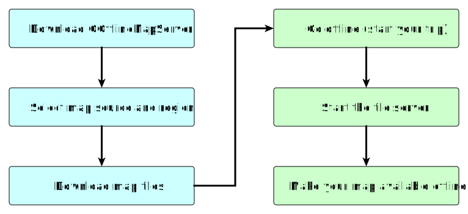
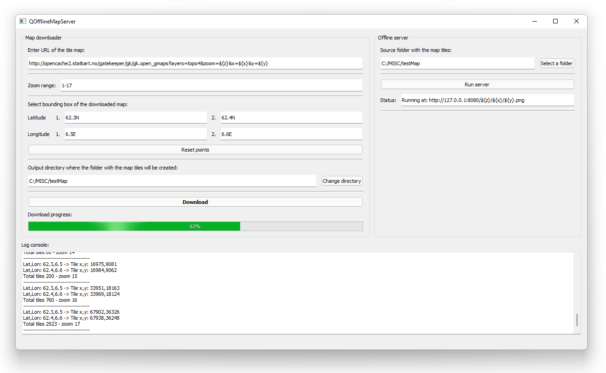

# QOfflineMapServer
Tool for downloading and serving XYZ tile maps inside offline networks.

I wish to express my thanks to [Griff Aviation AS](https://griffaviation.com/) for supporting this project.

## Download
- Latest release for Windows: [QOfflineMapServer_v1.0.zip](https://github.com/bsaid/QOfflineMapServer/releases/download/v1.0/QOfflineMapServer_v1.0.zip)

## GUI

## Examples of the map sources

### OpenStreetMap
- Standard [OpenStreetMap](https://www.openstreetmap.org/): [https://tile.openstreetmap.org/{z}/{x}/{y}.png](https://tile.openstreetmap.org/5/10/15.png)
- The application also supports tile server links with \$ sign in the address. For example: [OpenStreetMap](https://www.openstreetmap.org/): [https://tile.openstreetmap.org/${z}/${x}/${y}.png](https://tile.openstreetmap.org/5/10/15.png)
- 
- More details about OpenStreetMap tile servers are here: [https://wiki.openstreetmap.org/wiki/Tile_servers](https://wiki.openstreetmap.org/wiki/Tile_servers)

### Google maps
- Satellite: [http://mt0.google.com/vt/lyrs=s&hl=en&x={x}&y={y}&z={z}](http://mt0.google.com/vt/lyrs=s&hl=en&x=10&y=15&z=5)
- 
- Roadmap: [http://mt0.google.com/vt/lyrs=m&hl=en&x={x}&y={y}&z={z}](http://mt0.google.com/vt/lyrs=m&hl=en&x=10&y=15&z=5)
- 
- Terrain: [http://mt0.google.com/vt/lyrs=p&hl=en&x={x}&y={y}&z={z}](http://mt0.google.com/vt/lyrs=p&hl=en&x=10&y=15&z=5)
- 
- Altered roadmap: [http://mt0.google.com/vt/lyrs=r&hl=en&x={x}&y={y}&z={z}](http://mt0.google.com/vt/lyrs=r&hl=en&x=10&y=15&z=5)
- 
- Terrain: [http://mt0.google.com/vt/lyrs=t&hl=en&x={x}&y={y}&z={z}](http://mt0.google.com/vt/lyrs=t&hl=en&x=10&y=15&z=5)
- 
- Hybrid: [http://mt0.google.com/vt/lyrs=y&hl=en&x={x}&y={y}&z={z}](http://mt0.google.com/vt/lyrs=y&hl=en&x=10&y=15&z=5)
- 

### Norgeskart
- Map: [https://opencache2.statkart.no/gatekeeper/gk/gk.open_gmaps?layers=topo4&zoom={z}&x={x}&y={y}](https://opencache2.statkart.no/gatekeeper/gk/gk.open_gmaps?layers=topo4&zoom=5&x=17&y=7)
- 
- Satellite: [https://waapi.webatlas.no/maptiles/tiles/webatlas-orto-newup/wa_grid/{z}/{x}/{y}.jpeg?api_key=\*\*\*](https://waapi.webatlas.no/maptiles/tiles/webatlas-orto-newup/wa_grid/5/17/7.jpeg?api_key=\*\*\*)
